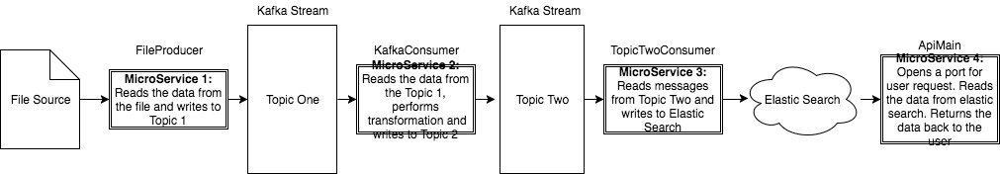

# Overall Design

## Build Instructions
Each Microservice can be started independently by going into each MicroService folder containing corresponding build.sbt using "sbt run" command

### Pre-requisites
1. Ensure that Zookeeper and Kafka stream server is running before starting any of the MicroService
2. For MicroService 3 and 4, i.e. TopicTwoConsumer and ApiMain, ensure that elastic search is started
